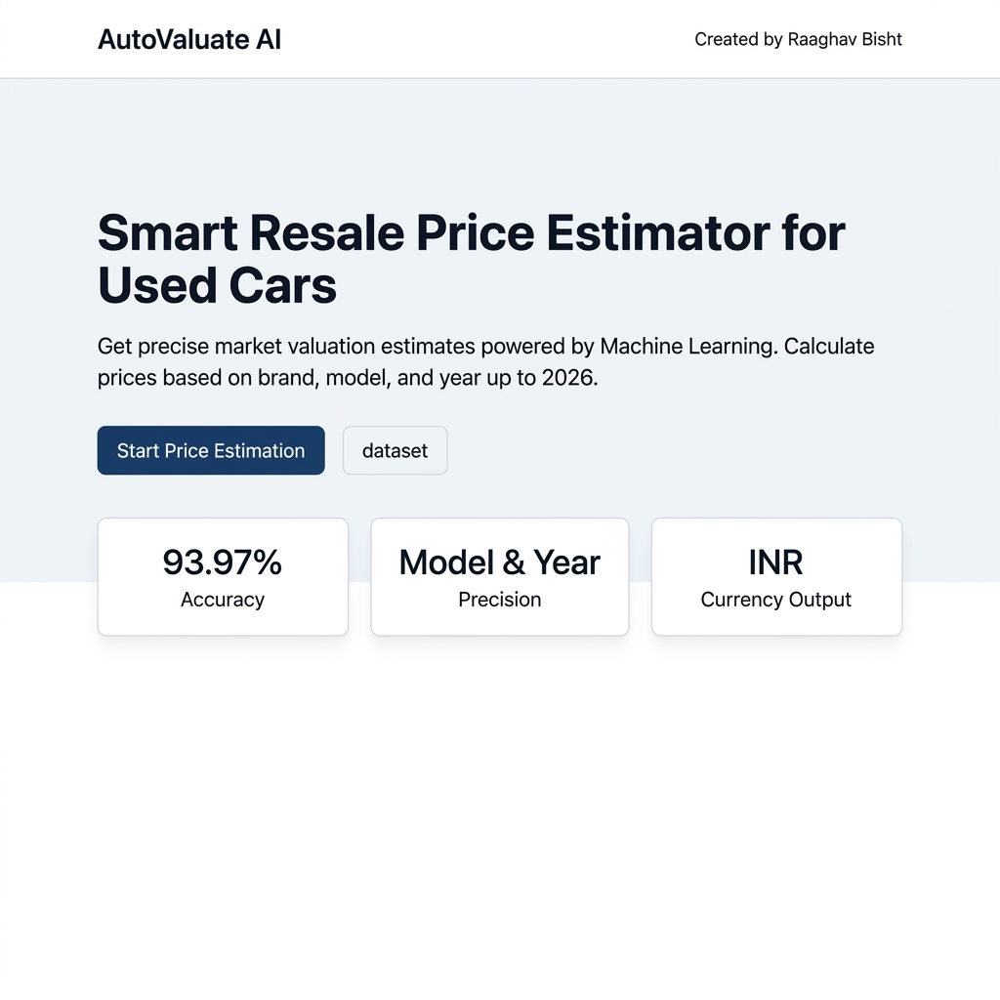
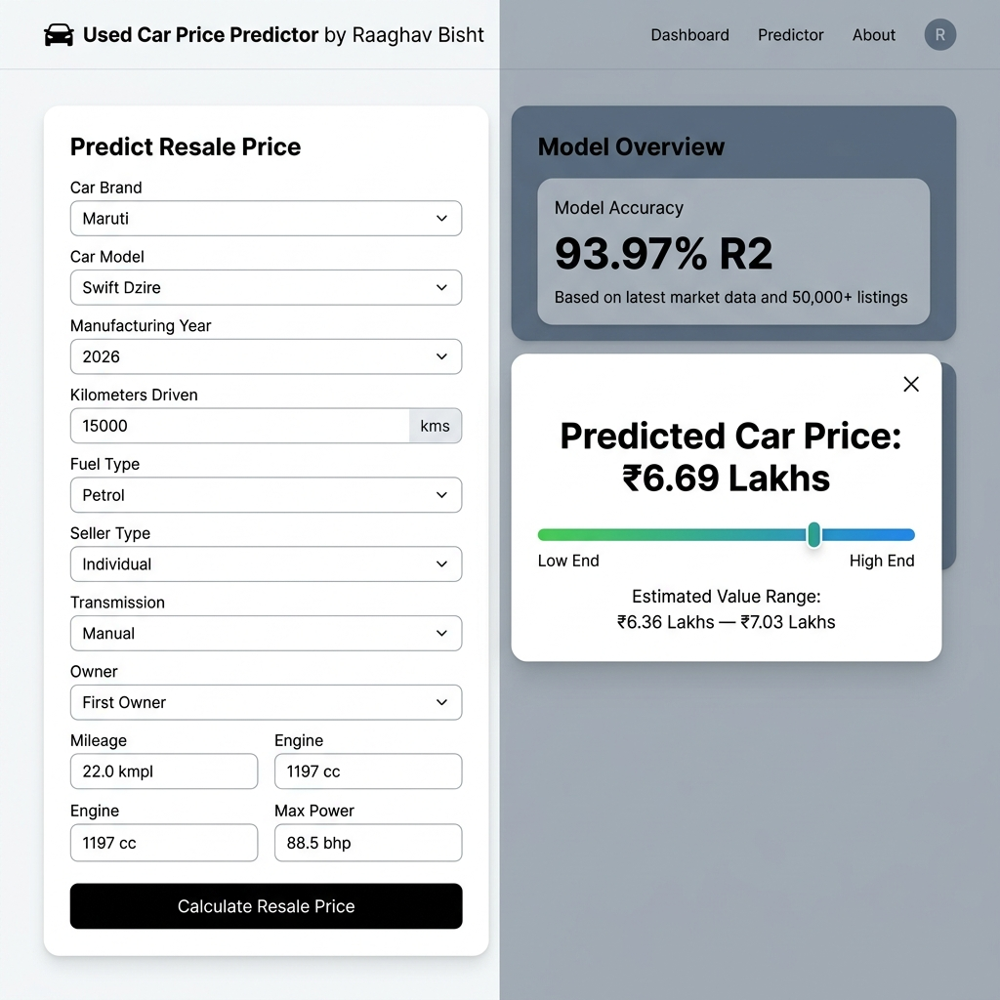

# 🚗 Used Car Price Predictor AI

A Machine Learning powered web application that estimates used car market resale prices with **93.97% accuracy (R² Score)**. Built and designed by **Raaghav Bisht**.

---

## 🌟 Visual Preview

### 🏠 Landing Page


### 📊 Resale Price Calculator Dashboard


---

## ✨ Features

- 🎯 **High Accuracy Prediction**: Ensemble Voting Regressor (`RandomForestRegressor` + `HistGradientBoostingRegressor`) achieving a **93.97% R² Score** and an average error of ~₹58,500.
- 🚘 **Brand & Model Precision**: Specific matching for major Indian car brands (Maruti, Hyundai, Honda, Toyota, Tata, Mahindra, etc.) and model series (e.g. Swift Dzire, Creta, City, Nexon).
- 📅 **Extended Year Support**: Fully supports manufacturing years up to **2026**.
- 💰 **INR Price Output**: Automatically formats valuation predictions into Indian Rupees (`₹6.69 Lakhs`).
- ⚡ **Lightweight Model**: ML pipeline compressed to **5.67 MB** (`joblib.dump(..., compress=3)`) for GitHub compatibility.

---

## 🛠️ Technology Stack

- **Frontend**: Next.js 15, React 19, TypeScript, Tailwind CSS, Lucide Icons, Shadcn UI.
- **Backend API**: Python 3, Flask, Flask-CORS, Gunicorn.
- **Machine Learning**: Scikit-Learn, Pandas, NumPy, Joblib.
- **Dataset**: `Cardetails.csv` (8,000+ Indian vehicle listings).

---

## 🚀 Quick Setup & Local Execution

### 1. Run Backend API
```bash
python3 -m venv venv
source venv/bin/activate
pip install -r requirements.txt
python app.py
```
*(Runs on `http://127.0.0.1:5001`)*

### 2. Run Next.js Frontend
```bash
npm install
npm run dev
```
*(Runs on `http://localhost:3000`)*

---

## 🌐 Deploying to Production

- **Frontend (Vercel)**: Import `Ignite01rb/usedcar` on Vercel. Set `NEXT_PUBLIC_API_URL` to your backend API URL.
- **Backend (PythonAnywhere / HuggingFace / Render)**: Deploy `app.py` with `requirements.txt`.

---

Developed with ❤️ by **Raaghav Bisht**
